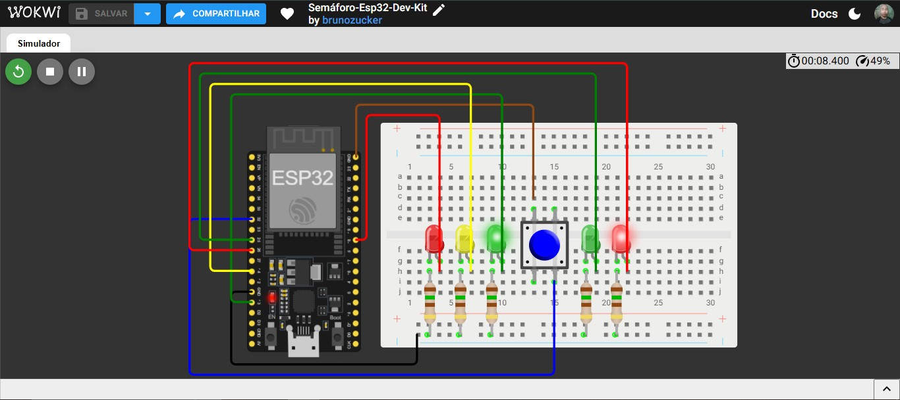

# 🚦 Semáforo-Esp32-Dev-Kit

Simulação de um semáforo com botão de travessia para pedestres, feita com a placa ESP32 DevKit no Wokwi.

---

## 📋 Sobre o projeto

A ideia foi simular um cruzamento com semáforo para carros e semáforo para pedestres. Em repouso, o sinal dos carros fica verde e o dos pedestres fica vermelho. Quando o pedestre aperta o botão, o semáforo dos carros passa pela sequência de aviso (vermelho e amarelo piscando) e fecha, liberando a travessia. Depois do tempo de travessia, tudo volta ao estado inicial.

O projeto foi feito como parte do meu portfólio prático de sistemas embarcados, usando o Wokwi como ambiente de simulação.

▶️ [Abrir a simulação no Wokwi](https://wokwi.com/projects/476159203372928001)

---

## 🛠 Ferramentas utilizadas

- Wokwi (simulador)
- ESP32 DevKit
- Protoboard
- 2 LEDs vermelhos
- 1 LED amarelo
- 2 LEDs verdes
- 5 resistores de 150 Ω
- 1 botão (push button)
- Linguagem C++ (API do Arduino)

---

## 🏗 O que foi montado

O circuito tem três blocos principais:

- Semáforo dos carros: três LEDs (verde, amarelo e vermelho) ligados aos pinos 13, 14 e 18, cada um com um resistor de 150 Ω em série e o outro lado no GND.
- Semáforo dos pedestres: dois LEDs (verde e vermelho) ligados aos pinos 25 e 26, também com resistor de 150 Ω em série.
- Botão de travessia: ligado entre o pino 32 e o GND. O pino usa o resistor de pull-up interno da placa, então não precisa de resistor externo.

### Pinagem

| Componente | Pino da ESP32 |
|---|---|
| LED verde (carros) | 13 |
| LED amarelo (carros) | 14 |
| LED vermelho (carros) | 18 |
| LED verde (pedestres) | 25 |
| LED vermelho (pedestres) | 26 |
| Botão de travessia | 32 |

---

## 🔧 Como funciona

1. No estado inicial, o LED verde dos carros e o LED vermelho dos pedestres ficam acesos.
2. Quando o botão é pressionado, o código espera 50 ms e confirma se ele continua pressionado (debounce simples).
3. O verde dos carros continua aceso por 5 segundos e depois apaga.
4. O vermelho dos carros pisca 3 vezes e, em seguida, o amarelo pisca 4 vezes.
5. O vermelho dos carros acende, o verde dos pedestres acende e o vermelho dos pedestres apaga.
6. Os pedestres têm 5 segundos para atravessar.
7. Os LEDs de travessia apagam e o ciclo volta ao estado inicial.

---

## 💻 Código

```cpp
// Semáforo-Esp32-Dev-Kit

// Define os pinos dos LEDs do semáforo dos carros
#define LED_S_VERDE 13
#define LED_S_AMARELO 14
#define LED_S_VERMELHO 18

// Define os pinos dos LEDs do semáforo dos pedestres
#define LED_P_VERDE 25
#define LED_P_VERMELHO 26

// Define o pino do botão para solicitar a travessia
#define BOTAO 32

void setup() {
  // LEDs do semáforo como "saída"
  pinMode(LED_S_VERDE, OUTPUT);
  pinMode(LED_S_AMARELO, OUTPUT);
  pinMode(LED_S_VERMELHO, OUTPUT);

  // LEDs do pedestre como "saída"
  pinMode(LED_P_VERDE, OUTPUT);
  pinMode(LED_P_VERMELHO, OUTPUT);

  // Configura o botão como entrada utilizando o resistor de pull-up interno
  pinMode(BOTAO, INPUT_PULLUP);
}

void loop() {
  // Estado inicial, ambos ligados
  digitalWrite(LED_S_VERDE, HIGH);
  digitalWrite(LED_P_VERMELHO, HIGH);

  // Espera o botão ser pressionado
  if (digitalRead(BOTAO) == LOW) 
  {
    // Debounce simples
    delay(50);
    
    // Confirma se o botão continua pressionado
    if (digitalRead(BOTAO) == LOW)
    {
      // Mantém o verde do semáforo durante 5 segundos
      delay(5000);

      // Apaga o verde do semáforo
      digitalWrite(LED_S_VERDE, LOW);

      // Vermelho do semáforo piscando três "i < 3;" vezes 
      for (int i = 0; i < 3; i++)
      {
        // Ligado
        digitalWrite(LED_S_VERMELHO, HIGH);
        delay(500);
        // Desligado
        digitalWrite(LED_S_VERMELHO, LOW);
        delay(500);
      }

      for (int i = 0; i < 4; i++)
      {
        // Ligado
        digitalWrite(LED_S_AMARELO, HIGH);
        delay(500);
        // Desligado
        digitalWrite(LED_S_AMARELO, LOW);
        delay(500);
      }
      // Semáfro vermelho ligado
      digitalWrite(LED_S_VERMELHO, HIGH);

      // Pedestre verde ligado
      digitalWrite(LED_P_VERDE, HIGH);

      // Pedestre vermelho desligado
      digitalWrite(LED_P_VERMELHO, LOW);

      // Tempo para o pedestre atravessar
      delay(5000);

      // LED verde do pedestre desligado
      digitalWrite(LED_P_VERDE, LOW);

      // LED vermelho do semáforo desligado
      digitalWrite(LED_S_VERMELHO, LOW);
    }
  }
}
```

---

## 📸 Evidências do funcionamento

### Circuito montado
A imagem mostra a placa ESP32 DevKit, a protoboard com os cinco LEDs, os resistores e o botão de travessia.



---

## 📁 Arquivo do diagrama

O arquivo diagram.json com todas as peças e conexões está disponível no repositório e pode ser importado direto no Wokwi.

[📥 Download — diagram.json](diagram.json)

---

## 💡 O que aprendi com esse projeto

O principal foi ver como o mesmo código funciona em uma placa totalmente diferente. O programa do semáforo foi reaproveitado quase inteiro, e o que mudou foram só os números dos pinos (13, 14, 18, 25, 26 e 32 na ESP32).

Também reforcei o uso do resistor de pull-up interno (`INPUT_PULLUP`) no botão, que dispensa resistor externo, e o debounce simples para evitar leituras falsas.

---

## ⚠️ Sobre o projeto

Essa simulação é uma base para estudo. Como o código usa `delay()`, a placa não lê o botão enquanto a sequência está rodando. Uma evolução natural seria trocar os `delay()` por `millis()` e organizar as etapas como uma máquina de estados.

---

## 🚀 Próximos projetos

Outros projetos de sistemas embarcados serão postados em breve, com níveis de complexidade maiores.

---

## 👤 Autor: Bruno Zucker
